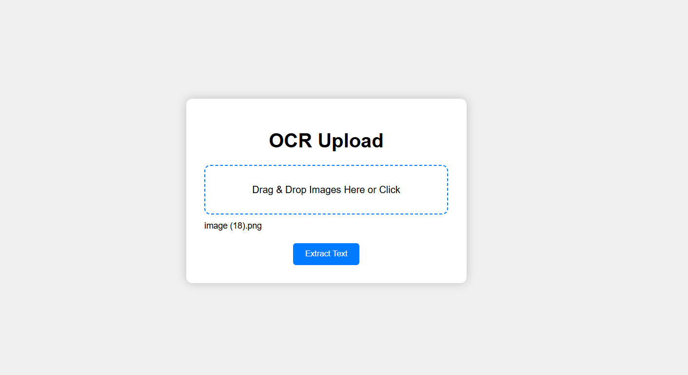
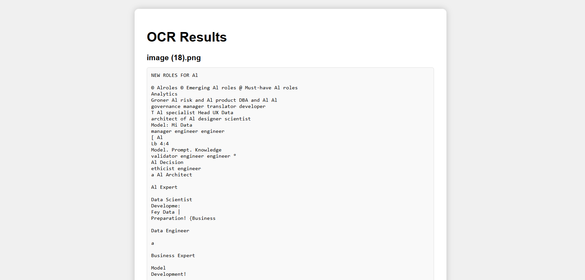

# OCR Web App

A simple and modern **OCR (Optical Character Recognition) web application** built with **Python Flask**, and **Tesseract OCR**.  
Supports **drag-and-drop** and **multiple image uploads**, extracting text from images quickly and easily.

---

## Features

- Drag-and-drop image upload  
- Multiple image upload at once  
- Shows selected file names before extracting  
- Extracts text from images using Tesseract OCR  
- Clean and responsive UI  
- Works on Windows with Tesseract installed  

---

## Demo





## Installation

### 1. Clone the repository

```bash
git clone https://github.com/shohagcsediu/OCR-Web-App.git
cd OCR-Web-App
```
### 2: Create a Python virtual environment (recommended)

```bash
python -m venv venv
```
Activate the virtual environment:
Windows

```bash
venv\Scripts\activate
```
Mac/Linux

```bash
source venv/bin/activate
```
### 3: Install dependencies

```bash
pip install -r requirements.txt
```
### 4: Install Tesseract OCR

Download the Windows installer from Tesseract at UB Mannheim

Install and note the installation path (default: C:\Program Files\Tesseract-OCR)

Make sure Tesseract is added to your system PATH or update app.py:

```bash
import pytesseract
pytesseract.pytesseract.tesseract_cmd = r"C:\Program Files\Tesseract-OCR\tesseract.exe"
```
### Usage
Start using 
```bash
python app.py
```
You can modify the bat file i have created this for my winsows machine.

enjoy :)
